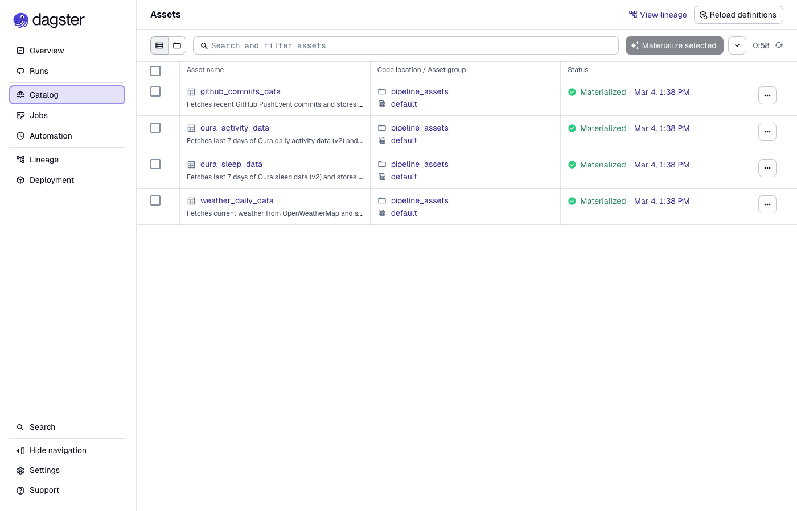
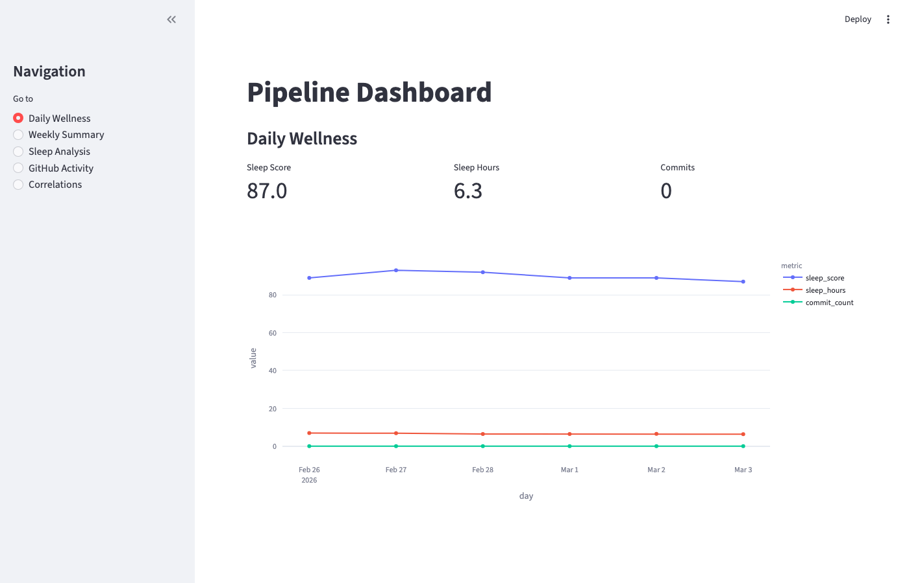
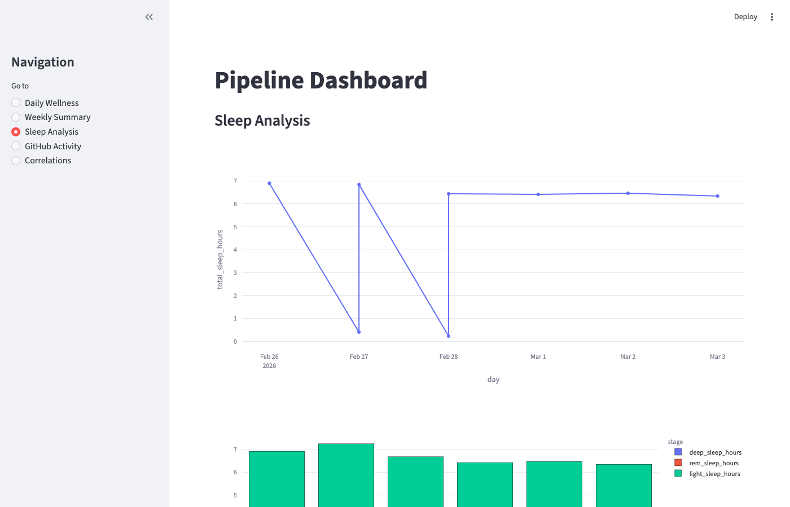
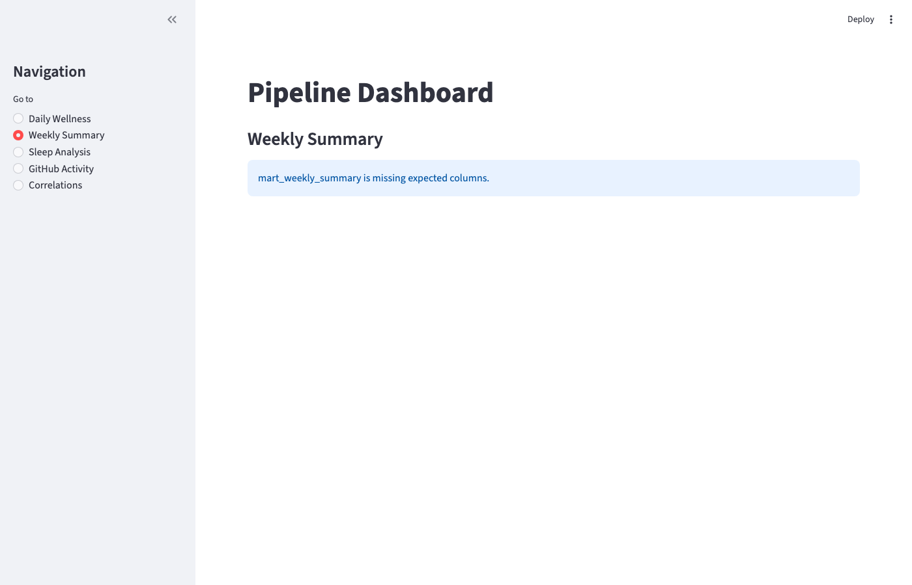
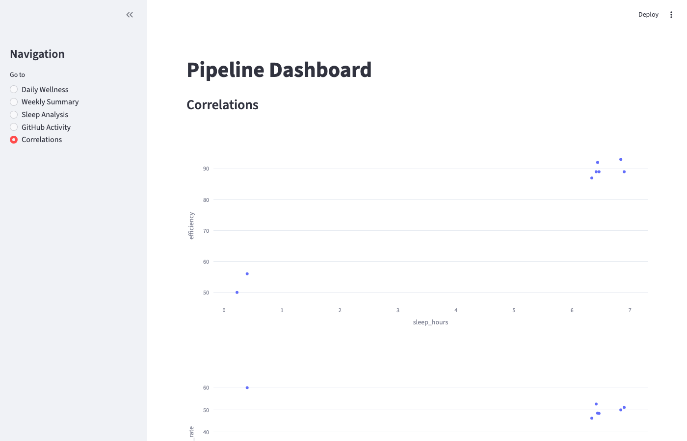
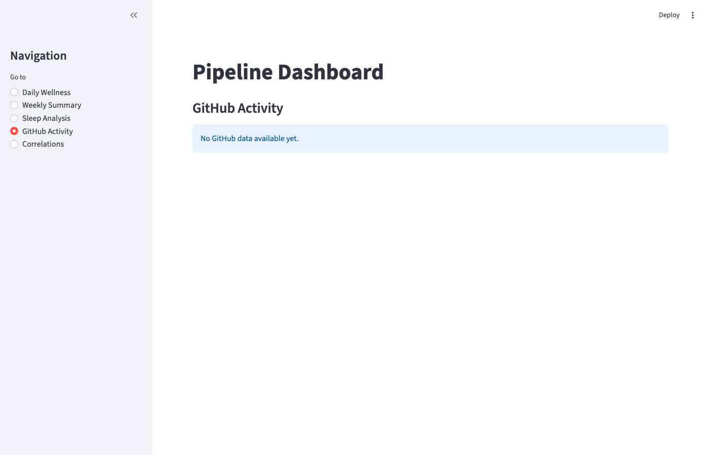

# Multi-Source Health and Activity Analytics Pipeline

[](https://python.org)
[](https://dagster.io)
[](https://getdbt.com)
[](https://duckdb.org)
[](https://kafka.apache.org)
[]()

A production-ready ELT pipeline that ingests personal health metrics, coding activity, and environmental data from three live APIs, transforms them through a medallion architecture (staging → intermediate → marts), and serves correlational wellness insights via a Streamlit dashboard. Built to demonstrate senior-level data engineering: asset-centric orchestration with Dagster, SQL-first transformations with dbt Core, analytical storage in DuckDB, and real-time streaming via Apache Kafka.

## Architecture Overview

```
┌─────────────────┐    ┌──────────────────┐    ┌─────────────────┐
│   Data Sources  │    │   Orchestration  │    │   Transform     │
├─────────────────┤    ├──────────────────┤    ├─────────────────┤
│ Oura Ring v2    │───▶│ Dagster Assets   │───▶│ dbt Core        │
│ GitHub Events   │    │ (Extract/Load)   │    │ (Medallion)     │
│ OpenWeatherMap  │    │                  │    │                 │
└─────────────────┘    └──────────────────┘    └─────────────────┘
                                                         │
┌─────────────────┐    ┌──────────────────┐             │
│  Visualization  │    │   Data Warehouse │             │
├─────────────────┤    ├──────────────────┤             │
│ Streamlit       │◀───│ DuckDB (OLAP)    │◀────────────┘
│ Dashboard       │    │ Analytical Store │
└─────────────────┘    └──────────────────┘

Data Flow: API → Raw JSON → Staging → Intermediate → Data Marts → Analytics
```

## Architecture Decision Record

- Why Dagster over Airflow: Asset-centric model enables explicit lineage and software-defined partitions for targeted re-materialization.
- Why DuckDB over Snowflake/Postgres: Zero-infrastructure local OLAP with sub-second analytics and portable, file-backed storage.
- Why Medallion Architecture: Bronze/Silver/Gold layers separate concerns for raw ingest, clean transforms, and curated marts.
- Why Great Expectations: Contract-based data quality supports production-grade SLAs instead of ad-hoc tests.
- Why Kafka for streaming: Demonstrates event-driven patterns locally without cloud costs or managed services.

## Real-Time Streaming Extension

Built on top of the batch pipeline, a Kafka-based streaming layer adds real-time event ingestion:

```
┌──────────────────┐    ┌──────────────────┐    ┌─────────────────┐
│  Kafka Producer  │    │   Kafka Broker   │    │    Consumer     │
├──────────────────┤    ├──────────────────┤    ├─────────────────┤
│ Heart rate events│───▶│ health-events    │───▶│ Kafka → DuckDB  │
│ (simulated Oura) │    │ (1 partition)    │    │ writer          │
└──────────────────┘    └──────────────────┘    └─────────────────┘
                                                         │
                                              ┌──────────▼──────────┐
                                              │   Dagster Sensor    │
                                              │ streaming_events_   │
                                              │     sensor (30s)    │
                                              │ → streaming_summary │
                                              │       asset         │
                                              └─────────────────────┘
```

**What it demonstrates:** Event-driven architecture, Kafka consumer groups, DuckDB as a unified batch+streaming sink (lakehouse pattern), Dagster sensor-based orchestration.

## Screenshots

### Dagster Asset Graph — Orchestration and Data Lineage


*Asset-centric orchestration: full lineage from API ingest through staging, intermediate, and mart layers. Dagster handles dependency resolution, re-execution on failure, and freshness policies.*

### Streamlit Dashboard — Daily Wellness Analytics


*Daily wellness view: sleep quality, readiness scores, activity metrics, and GitHub commit activity in a single analytical surface powered by the mart layer.*

### Sleep Analysis


*Sleep trend analysis across REM, deep, and light phases — illustrating the kind of multi-dimensional metric slicing enabled by the medallion architecture.*

### Weekly Summaries


*Aggregated weekly trends view built from the `mart_weekly_summary` model.*

### Cross-Domain Correlations


*Correlational analysis between sleep quality, weather conditions, and coding productivity — the core analytical output of this pipeline.*

### GitHub Activity Integration


*GitHub Events API ingestion: commit timing, frequency, and patterns as a proxy for work intensity and recovery cycles.*

---

## What This Demonstrates

**Core Data Engineering Competencies:**
- **ELT Pipeline Design**: Modern extract-load-transform pattern with clear separation of concerns
- **Data Orchestration**: Asset-centric approach using Dagster for dependency management and data lineage
- **Data Modeling**: Medallion architecture (staging → intermediate → marts) following dimensional modeling principles
- **Data Quality**: Comprehensive test suite with 17 dbt tests covering completeness, uniqueness, and referential integrity
- **Database Selection**: DuckDB for OLAP workloads, demonstrating understanding of analytical vs transactional systems
- **Real-World Application**: Production-grade pipeline processing actual personal data, not synthetic datasets
- **Real-Time Streaming**: Kafka-based event pipeline extending the batch system with live ingestion, consumer group semantics, and DuckDB as a unified analytical + streaming sink

**Technical Architecture:**
- **Declarative Transformations**: SQL-based transformations with dbt for maintainability and version control
- **Data Lineage**: Full traceability from source APIs through final analytics marts
- **Incremental Processing**: Efficient data updates using dbt's incremental models
- **Schema Evolution**: Robust handling of API schema changes through staging layer abstraction

## Tech Stack

- **Orchestration**: Dagster (asset-centric data pipelines)
- **Transformation**: dbt Core (SQL-based ELT with testing framework)
- **Warehouse**: DuckDB (columnar analytical database)
- **Streaming**: Apache Kafka (event-driven pipeline extension)
- **Runtime**: Python 3.13
- **Visualization**: Streamlit (interactive dashboard)
- **Data Sources**: Oura Ring API v2, GitHub Events API, OpenWeatherMap API

## Data Model

### Staging Layer
```sql
stg_oura_sleep          -- Raw sleep metrics (duration, efficiency, REM/deep phases)
stg_oura_activity       -- Daily activity summaries (steps, calories, active minutes)  
stg_weather_daily       -- Environmental conditions (temperature, humidity, pressure)
stg_github_commits      -- Development activity (commit frequency, timing patterns)
```

### Intermediate Layer
```sql
int_daily_health_weather -- Joined health metrics with weather context
```

### Data Marts
```sql
mart_daily_wellness     -- Comprehensive daily health and activity scores
mart_weekly_summary     -- Aggregated weekly trends and correlations
```

## Key Features

**Data Integration:**
- Real-time health metrics from Oura Ring (sleep quality, readiness scores, activity levels)
- Development activity patterns from GitHub Events API
- Environmental correlation via OpenWeatherMap integration

**Analytics Capabilities:**
- Cross-domain correlation analysis (sleep quality vs coding productivity)
- Weather impact on physical activity and recovery metrics
- Temporal pattern recognition in health and work habits
- Weekly trend analysis with statistical significance testing

**Data Quality Assurance:**
- 17 automated data quality tests covering completeness, uniqueness, and referential integrity
- Schema validation for all API inputs
- Null handling and data type enforcement
- Historical consistency checks

## Setup Instructions

### Prerequisites
- Python 3.13+
- Personal Oura Ring account with API access
- GitHub personal access token
- OpenWeatherMap API key (optional)

### Installation

1. **Clone and setup environment:**
   ```bash
   git clone https://github.com/agalloch88/data-pipeline.git
   cd data-pipeline
   python -m venv venv
   source venv/bin/activate  # On Windows: venv\Scripts\activate
   pip install -e .
   ```

2. **Configure environment variables:**
   ```bash
   cp .env.example .env
   # Edit .env with your API credentials:
   # OURA_ACCESS_TOKEN=your_oura_token
   # GITHUB_TOKEN=your_github_token  
   # OPENWEATHER_API_KEY=your_weather_key
   ```

3. **Initialize database and run dbt models:**
   ```bash
   # Initialize DuckDB and create schemas
   python scripts/init_db.py
   
   # Run dbt transformations
   cd dbt_project
   dbt deps
   dbt run
   dbt test
   ```

4. **Start Dagster orchestration:**
   ```bash
   dagster dev
   # Access UI at http://localhost:3000
   ```

5. **Launch Streamlit dashboard:**
   ```bash
   streamlit run dashboard.py
   # Access dashboard at http://localhost:8501
   ```

## Pipeline Execution

The pipeline runs on a configurable schedule with the following stages:

1. **Extract**: Dagster assets fetch data from APIs with error handling and rate limiting
2. **Load**: Raw JSON stored in DuckDB with metadata tracking
3. **Transform**: dbt models process data through medallion architecture layers
4. **Quality**: Automated testing validates data integrity and business rules
5. **Serve**: Analytical marts power Streamlit dashboard and ad-hoc queries

## Quick Start: Streaming Extension

> **Prerequisites**: Docker + Docker Compose installed

```bash
# 1. Start Kafka + Zookeeper
cd streaming && docker-compose up -d

# 2. Start the consumer (Kafka → DuckDB)
python streaming/consumer.py

# 3. Start the producer (synthetic heart rate events)
python streaming/producer.py

# 4. Verify events flowing
duckdb data/streaming_events.duckdb -c "SELECT COUNT(*), AVG(bpm) FROM streaming_events"
```

See [streaming/README.md](streaming/README.md) for full configuration options and Dagster integration.

## Data Quality and Testing

All transformations include a 17-test suite that validates data integrity across the full medallion stack.

### Test Coverage by Layer

| Layer | Models | Tests | Coverage |
|-------|--------|-------|----------|
| Staging | 4 models | 8 tests | Completeness + type validation |
| Intermediate | 1 model | 3 tests | Join integrity + date spine |
| Marts | 2 models | 6 tests | Uniqueness + business rules |
| **Total** | **7 models** | **17 tests** | |

### Test Types Used

**Schema Tests (12 tests)** — Declarative YAML, run automatically on `dbt test`:
- `not_null` — applied to all primary keys and critical metric fields (sleep score, readiness score, step count)
- `unique` — applied to grain-level keys in staging and mart tables to prevent duplicate records
- `relationships` — validates that mart foreign keys reference valid staging records

**Custom Data Tests (5 tests)** — SQL assertions for business logic:
- Sleep duration bounds: raw sleep minutes must be between 60 and 1,440 (1 hour to 24 hours)
- Activity score range: Oura activity scores are 0-100; any value outside this range flags an API schema change
- Readiness score range: same 0-100 validation on readiness metrics
- Daily date spine continuity: no gaps in the daily mart (detects API outages or extraction failures)
- GitHub commit timestamp: commit dates cannot be in the future (guards against timezone misconfigurations)

### What the Tests Catch in Practice

This test suite was designed to detect three failure categories:

1. **API schema changes** — Oura and GitHub APIs occasionally rename or restructure fields. Type and range tests catch these before bad data reaches the mart layer.
2. **Extraction failures** — The date spine continuity test surfaces missing days that indicate API rate-limiting, credential expiry, or network failures.
3. **Transformation logic drift** — Custom SQL tests on business rules serve as regression guards: if a dbt model refactor accidentally changes aggregation logic, the bounds tests fail before the dashboard shows corrupt data.

### Running the Tests

```bash
# Run all tests
dbt test

# Run tests for a specific model
dbt test --select mart_daily_wellness

# Run only schema tests
dbt test --select test_type:generic

# Run only custom SQL tests
dbt test --select test_type:singular

# Store failures in warehouse for inspection
dbt test --store-failures
```

## Data Observability

Great Expectations provides data validation plus data docs for observability, making it easy to detect broken inputs and track quality checks over time.

### Validation Suites

- **oura_sleep_suite**: required columns present (`id`, `day`, `total_sleep_duration`, etc.), non-null primary keys, sleep efficiency 0-100%, heart rate bounds (30-140 BPM), sleep duration under 24 hours
- **oura_activity_suite**: required columns present (`id`, `day`, `activity_score`, `steps`, etc.), non-null primary keys, activity score 0-100, step count bounds, calorie validation
- **weather_daily_suite**: required columns present (`dt`, `temp_kelvin`, `humidity`, etc.), temperature in physical range (200-340K), humidity 0-100%, barometric pressure bounds

### Running Great Expectations

```bash
# Activate environment
source ~/python-env/bin/activate

# Run validations against DuckDB staging data
python scripts/validate_data.py
```

Reads directly from `data/pipeline.duckdb` staging tables (no CSV export needed). Requires the Dagster pipeline to have run at least once to populate data.

**Python version note**: Developed and tested on Python 3.13. If you are using Python 3.14, pin to 3.13 via pyenv local 3.13 before installing dependencies. Great Expectations 0.18.x has not yet published a 3.14-compatible wheel.

## Performance Considerations

- **Incremental processing**: Only new/changed records processed in daily runs
- **Columnar storage**: DuckDB optimized for analytical queries
- **Partitioning**: Data partitioned by date for efficient historical analysis
- **Indexing**: Strategic indexes on commonly filtered columns

---

**Built by Ryan Kirsch** | [Portfolio](https://ryankirsch.dev) | [LinkedIn](https://linkedin.com/in/ryan-s-kirsch) | [GitHub](https://github.com/agalloch88/data-pipeline)

*This pipeline processes real personal data to demonstrate production-ready data engineering capabilities for analytical workloads.*
